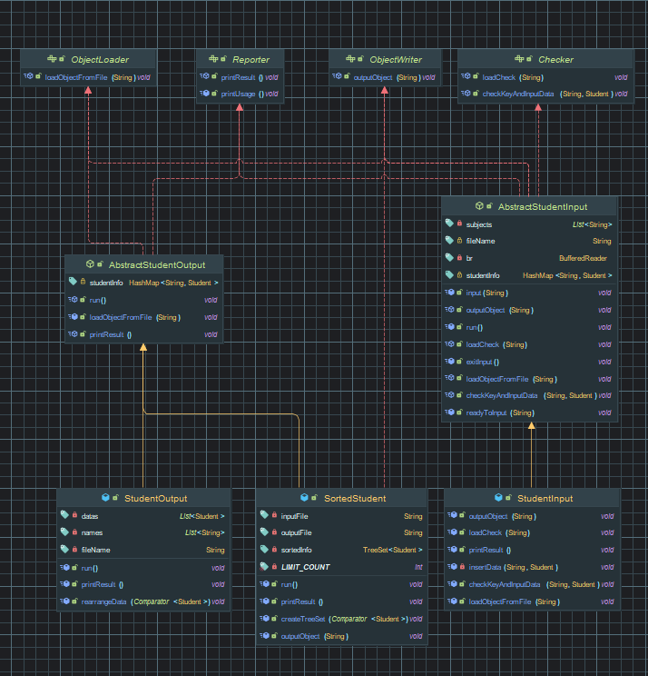
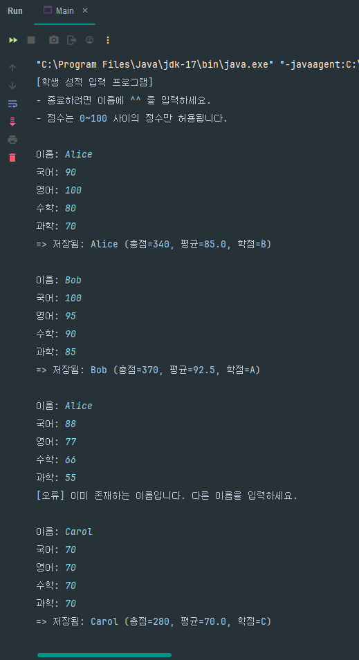
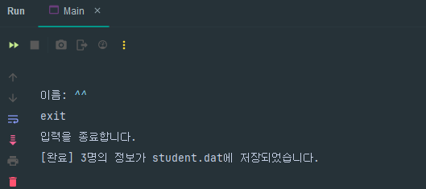
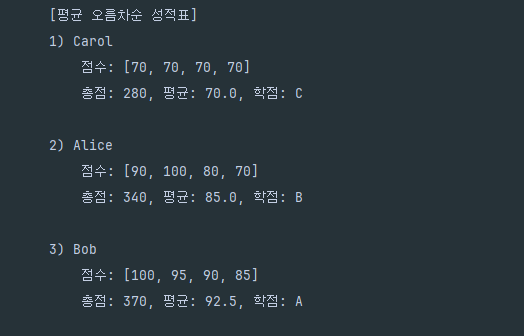

## 1. 클래스 구조 설명



### 인터페이스
- `Checker`: 입력한 학생 이름과 점수의 유효성 검사
- `ObjectLoader`: 파일에서 역직렬화하여 `Student` 객체로 변환
- `ObjectWriter`: `Student` 객체를 직렬화하여 파일에 저장
- `Reporter`: 콘솔창에 `Student` 객체의 데이터를 출력

### 추상 클래스

- 인터페이스에 정의된 기능들을 조합하여 `StudentInput`, `StudentOutput`, `SortedStudent` 클래스의 대략적인 골격을 제공

**AbstractStudentInput**
- `StudentInput` 클래스의 기본적인 윤곽을 나타내기 위한 추상 메서드
- `ObjectLoader`, `ObjectWriter`, `Checker` 인터페이스를 구현

**AbstractStudentOutput**
- `StudentOutput`과 `SortedStudent`에서 공통으로 사용하는 기능을 구현
- `OrderLoader`, `Reporter` 인터페이스를 구현

### 주요 클래스
- `Student` : 학생 이름 및 점수를 저장하는 객체(직렬화 가능)
- `StudentInput` : 콘솔에서 학생 정보를 입력받고, 이를 직렬화하여 `student.dat` 파일에 저장
- `StudentOutput` : `student.dat` 파일에서 학생 객체들을 읽어와 평균 기준 오름차순으로 정렬 후 콘솔창에서 출력
- `SortedStudent` : `student.dat` 파일에서 읽어온 `Student` 객체들을 평균 기준 오름차순으로 정렬한 결과를 `orderByAvg.dat`에 저장

---

## 2. 구현 결과 출력

### 1) 학생 점수 입력




### 2) 학생 점수 출력(콘솔창)




### 3) 학생 점수 정렬 후 TreeSet을 orderByAvg.dat 파일에 저장




### 4) 기존 파일에 이어서 작성

- 이미 `student.dat` 파일이 존재할 경우 이전 내용 뒤에 이어서 저장


---

- 과제 안내사항에 명시된 기본 기능을 수행하는 메서드 중 기능과 파라미터가 동일한 일부 메서드의 이름을 하나로 통일
- 이에 따라, 각각의 주요 기능마다 변경한 메서드 시그니처는 아래와 동일
  (각각의 메서드는 클래스별로 정리)

### StudentInput 클래스

- 기존 직렬화 파일 유무 확인 및 로드: `loadCheck(String)`
- 사용법/입력 안내 출력용 메서드: `printUsage()`(파라미터 없음)
- 중복 이름 검사 및 점수 유효성 검사 후 total/average/grade 산출 후 맵에 저장: `checkKeyAndInputData(String, Student)`
- 직렬화 수행: `outputObject(String)`
- **안내사항의 `saveData()`를 `outputObject(String)`로 대체**

### StudentOutput 클래스

- 역직렬화 수행: `loadObjectFromFile(String)`
- 평균 기준 정렬: `rearrangeData(Comparator<Student>)`
- 정렬의 결과를 출력: `printResult()`
- **안내사항의 `printInfo()` 메서드를 `printResult()`로 대체**

### SortedStudent 클래스

- 역직렬화 수행: `loadObjectFromFile(String)`
- TreeSet 구성 및 정렬: `createTreeSet(Comparator<Student>)`
- 정렬의 결과를 출력: `printResult()`
- 직렬화 수행: `outputObject(String)`

### 기타 메서드

- 코드를 분리하여 가독성을 높이기 위해 메서드를 추가(해당 메서드에는 주석 표시)
- 자세한 코드는 아래 링크에서 확인 가능
  [깃허브 코드 저장소 링크](https://github.com/HyeonBin2379/team-mission-v1/tree/hyeonbin-lee/src/student)

---

## 구현 코드

### Main 클래스

```java
public class Main {

    public static void main(String[] args) {
        StudentInput studentInput = new StudentInput("student.dat");
        studentInput.run();
        StudentOutput studentOutput = new StudentOutput("student.dat");
        studentOutput.run();
        SortedStudent sortedStudent = new SortedStudent("student.dat","orderByAvg.dat");
        sortedStudent.run();
    }
}
```

### 인터페이스

**Checker**

```java
// 입력한 데이터에 관한 유효성 검사를 수행
public interface Checker {

    void loadCheck(String fileName) throws FileNotFoundException;

    void checkKeyAndInputData(String key, Student value) throws IOException;
}
```

**ObjectLoader**

```java
// 객체 역직렬화
public interface ObjectLoader {

    void loadObjectFromFile(String fileName) throws IOException, ClassNotFoundException;
}
```

**ObjectWriter**

```java
// 객체 직렬화
public interface ObjectWriter {

    void outputObject(String fileName) throws IOException;
}
```

**Reporter**

```java
// 콘솔창에 결과를 출력
public interface Reporter {

    default void printUsage() {
        System.out.println("""
            - 종료하려면 이름에 ^^ 를 입력하세요.
            - 점수는 0~100 사이의 정수만 허용됩니다.
            """);
    }

    void printResult();
}
```


### 추상 클래스

**AbstractStudentInput**

* `StudentInput` 클래스의 대략적인 로직을 구현

```java
public abstract class AbstractStudentInput implements Checker, ObjectLoader, ObjectWriter, Reporter {

    private final BufferedReader br = new BufferedReader(new InputStreamReader(System.in));
    private final List<String> subjects = Arrays.asList("국어: ", "영어: ", "수학: ", "과학: ");

    protected final String fileName;
    protected HashMap<String, Student> studentInfo;

    public AbstractStudentInput(String fileName) {
        this.fileName = fileName;
    }

    // StudentInput의 전체 로직
    public void run() {
        readyToInput(fileName);
        while (true) {
            try {
                System.out.print("이름: ");
                String studentName = br.readLine();
                if (studentName.equals("^^")) {
                    exitInput();
                    break;
                }
                input(studentName);
            } catch (IOException | IllegalArgumentException e) {
                System.out.println(e.getMessage());
            }
        }
    }

    // 입력 전 준비 단계
    public void readyToInput(String fileName) {
        System.out.println("[학생 성적 입력 프로그램]");
        try {
            // student.dat 파일 불러오기 및 학생 성적 입력방법 안내
            loadCheck(fileName);
            // 인터페이스의 디폴트 메서드 사용
            printUsage();
        } catch (FileNotFoundException e) {
            System.out.println(e.getMessage());
        }
    }

    // 점수 입력
    public void input(String studentName) throws IOException, IllegalArgumentException {
        List<String> record = new ArrayList<>();
        for (String subject : subjects) {
            System.out.print(subject);
            String score = br.readLine();
            record.add(score);
        }
        checkKeyAndInputData(studentName, new Student(studentName, record));
    }

    // 입력 종료 단계
    public void exitInput() throws IOException {
        System.out.println("exit\n입력을 종료합니다.");
        outputObject(fileName);
        printResult();
    }

    // 기존 파일 유무 확인 및 로드
    @Override
    public abstract void loadCheck(String fileName) throws FileNotFoundException;

    // 기존 파일 로드
    @Override
    public abstract void loadObjectFromFile(String fileName) throws IOException, ClassNotFoundException;

    // 입력된 학생명 및 점수 유효성 검사
    @Override
    public abstract void checkKeyAndInputData(String key, Student value) throws IOException;

    // 직렬화 수행
    @Override
    public abstract void outputObject(String fileName) throws IOException;
}
```

**AbstractStudentOutput**

* `SortedStudent`, `StudentOutput` 클래스에서 공통으로 사용되는 기능을 추상 클래스로 분리

```java
public abstract class AbstractStudentOutput implements ObjectLoader, Reporter {

    protected HashMap<String, Student> studentInfo;

    public AbstractStudentOutput() {
        this.studentInfo = new HashMap<>();
    }
    
    // 파일 불러오기
    @Override
    public void loadObjectFromFile(String fileName) throws IOException, ClassNotFoundException {
        // C:/Temp/ 폴더에 저장된 student.dat 파일을 로드
        Path path = Paths.get("C:/Temp/" + fileName);
        try (ObjectInputStream ois = new ObjectInputStream(Files.newInputStream(path))) {
            studentInfo = (HashMap<String, Student>) ois.readObject();
        }
    }

    // 정렬 결과 출력 - 출력 방식의 차이로 인해 추상클래스로 분리
    @Override
    public abstract void printResult();

    // StudentOutput과 SortedStudent의 전체적인 로직이 다르므로, 추상 메서드로 선언
    public abstract void run();
}
```


### 구현 클래스

**StudentInput**


**StudentOutput**

**SortedStudent**