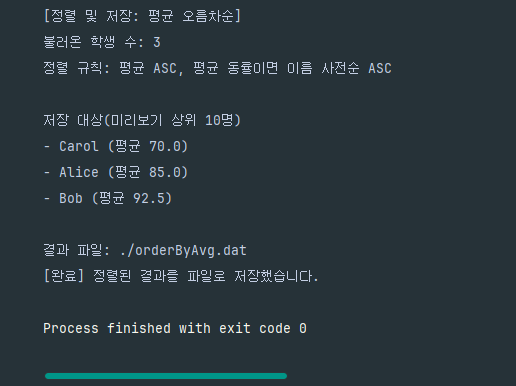
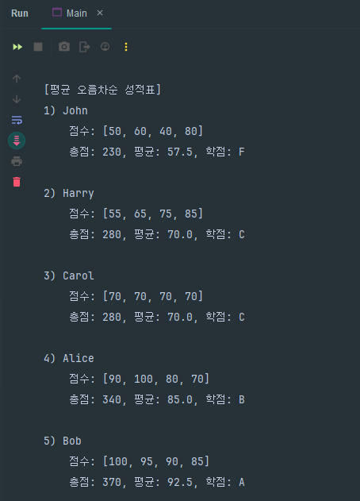
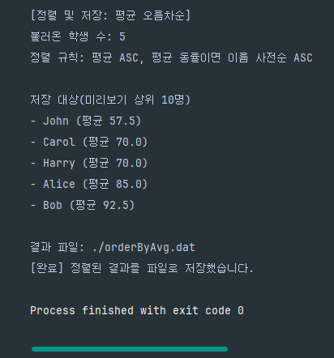

## 1. 클래스 구조 설명


### 인터페이스
- `Checker`: 기존 `student.dat` 파일의 유무 확인 및 입력 데이터의 유효성 확인
- `ObjectLoader`: `student.dat` 파일에 저장된 바이트코드를 역직렬화하여 `Student` 객체로 변환
- `ObjectWriter`: `Student` 객체를 직렬화하여 `student.dat` 파일에 저장
- `Reporter`: 콘솔창에 입력 방법 안내문 또는 작업 수행 결과를 출력

### 추상 클래스

- 메서드의 중복을 줄이기 위해 인터페이스를 활용
- 여러 인터페이스를 조합하여 `StudentInput`, `StudentOutput`, `SortedStudent` 클래스의 대략적인 골격을 제공

**AbstractStudentInput**
- `StudentInput` 클래스의 기본적인 밑바탕이 되는 추상 메서드
- `ObjectLoader`, `ObjectWriter`, `Checker`, `Reporter` 인터페이스를 사용하여 큰 틀에서의 `StudentInput`의 로직을 구현
- 

**AbstractStudentOutput**
- `StudentOutput`과 `SortedStudent`에서 공통적으로 사용하는 메서드를 정의
- `OrderLoader`, `Reporter` 인터페이스의 메서드를 구현

### 주요 클래스
- `Student` : 학생 이름 및 점수를 저장하는 객체(직렬화 가능)
- `StudentInput` : 콘솔에서 학생 정보를 입력받고, 이를 직렬화하여 `student.dat` 파일에 저장
- `StudentOutput` : `student.dat` 파일에서 학생 객체들을 읽어와 평균 기준 오름차순으로 정렬 후 콘솔창에서 출력
- `SortedStudent` : `student.dat` 파일에서 읽어온 `Student` 객체들을 평균 기준 오름차순으로 정렬한 결과를 `orderByAvg.dat`에 저장

---

## 2. 구현 결과 출력

### 1) 학생 점수 입력


### 2) StudentOutput에서 정렬 후 학생 점수 출력(콘솔창)


### 3) SortedStudent에서 정렬 후 orderByAvg.dat 파일에 저장




### 4) 기존 파일에 이어서 작성

- 이미 `student.dat` 파일이 존재할 경우 이전 내용 뒤에 이어서 저장






---

- 과제 안내사항에 명시된 기본 기능을 수행하는 메서드 중 기능과 파라미터가 동일한 일부 메서드의 이름을 하나로 통일
- 이에 따라, 일부 메서드 시그니처를 변경
  (각각의 메서드는 클래스별로 정리)

### StudentInput 클래스

- `student.dat` 파일의 유무 확인 및 로드: `loadCheck(String)`
  - 기존 파일을 로드할 때 `loadObjectFromFile(String)`의 메서드를 재사용
- 사용법/입력 안내 출력용 메서드: `printUsage()`(파라미터 없음)
- 학생 이름의 중복/점수의 유효성 검사 후 학생의 total/average/grade를 계산하여 맵에 저장: `checkKeyAndInputData(String, Student)`
- Student 객체를 대상으로 직렬화 수행: `outputObject(String)`
- **안내사항의 `saveData()`를 `outputObject(String)`로 대체**

### StudentOutput 클래스

- `student.dat` 파일의 데이터를 역직렬화하여 맵 불러오기: `AbstractStudentOutput`에서 구현한 `loadObjectFromFile(String)`를 사용
- 평균 기준 정렬: `rearrangeData(Comparator<Student>)`
- 정렬 결과를 출력: `printResult()`
- **안내사항의 `printInfo()` 메서드의 이름을 `printResult()`로 변경**

### SortedStudent 클래스

- 역직렬화 수행: `loadObjectFromFile(String)`
- TreeSet 생성 및 정렬 기준 설정(평균 기준 오름차순, 평균 동일할 시 이름을 사전순으로): `createTreeSet(Comparator<Student>)`
- 정렬 결과 출력: `printResult()`
- 직렬화 수행: `outputObject(String)`

### 기타 메서드

- 코드를 분리하여 가독성을 높이기 위해 메서드를 추가(해당 메서드에는 주석 표시)
- 자세한 코드는 아래 링크에서 확인 가능
  [깃허브 코드 저장소 링크](https://github.com/HyeonBin2379/team-mission-v1/tree/hyeonbin-lee/src/student)

---

## 구현 코드

### Student 클래스

```java
public class Student implements Serializable {
    // 요구사항에 맞게 student.domain.Student 클래스를 구현
    @Serial
    private static final long serialVersionUID = 1L;

    private final String name;
    private final List<Integer> record;
    private int total;
    private double average;
    private String grade;

    public Student(String name, List<String> record) throws IllegalArgumentException {
        this.name = name;
        validateRecord(record);
        this.record = record.stream()
                .map(Integer::parseInt)
                .collect(Collectors.toList());
    }
    private void validateRecord(List<String> record) {
        if (record.stream().anyMatch(score -> score.isEmpty() || !score.matches("[0-9]+$"))) {
            throw new IllegalArgumentException("[오류] 정수로 변환할 수 없는 점수입니다.");
        }
    }

    public String getName() {
        return name;
    }

    public List<Integer> getRecord() {
        return record;
    }
    
    public double getAverage() {
        return average;
    }

    // 점수 총합, 평균, 등급 계산
    public void setTotal() {
        this.total = record.stream()
                .mapToInt(Integer::intValue)
                .sum();
    }

    public void setAverage() {
        this.average = (double) this.total / record.size();
    }

    public void setGrade() {
        if (average >= 90) {
            this.grade = "A";
        } else if (average >= 80) {
            this.grade = "B";
        } else if (average >= 70) {
            this.grade = "C";
        } else if (average >= 60) {
            this.grade = "D";
        } else {
            this.grade = "F";
        }
    }

    // 출력 형식 지정
    public String outputFormat(int number) {
        String resultFormat = """
                    %d) %s
                        점수: %s
                        총점: %d, 평균: %.1f, 학점: %s
                    """;
        return String.format(resultFormat, number, name, record, total, average, grade);
    }

    @Override
    public String toString() {
        return String.format("%s (총점=%d, 평균=%.1f, 학점=%s)", name, total, average, grade);
    }
}
```

### Main 클래스

- `StudentInput` -> `StudentOutput` -> `SortedStudent` 순으로 실행

```java
public class Main {

    public static void main(String[] args) {
        StudentInput studentInput = new StudentInput("student.dat");
        studentInput.run();
        StudentOutput studentOutput = new StudentOutput("student.dat");
        studentOutput.run();
        SortedStudent sortedStudent = new SortedStudent("student.dat","orderByAvg.dat");
        sortedStudent.run();
    }
}
```

### 인터페이스

**Checker**

```java
// 입력한 데이터에 관한 유효성 검사를 수행
public interface Checker {

    void loadCheck(String fileName) throws FileNotFoundException;

    void checkKeyAndInputData(String key, Student value) throws IOException;
}
```

**ObjectLoader**

```java
// 객체 역직렬화
public interface ObjectLoader {

    void loadObjectFromFile(String fileName) throws IOException, ClassNotFoundException;
}
```

**ObjectWriter**

```java
// 객체 직렬화
public interface ObjectWriter {

    void outputObject(String fileName) throws IOException;
}
```

**Reporter**

```java
// 콘솔창에 결과를 출력
public interface Reporter {

    default void printUsage() {
        System.out.println("""
            - 종료하려면 이름에 ^^ 를 입력하세요.
            - 점수는 0~100 사이의 정수만 허용됩니다.
            """);
    }

    void printResult();
}
```


### 추상 클래스

**AbstractStudentInput**

* `StudentInput` 클래스의 대략적인 로직을 구현

```java
// 콘솔창으로 입력받은 학생별 성적을 직렬화하여 파일로 내보냄
public abstract class AbstractStudentInput implements Checker, ObjectLoader, ObjectWriter, Reporter {

  private final BufferedReader br = new BufferedReader(new InputStreamReader(System.in));
  private final List<String> subjects = Arrays.asList("국어: ", "영어: ", "수학: ", "과학: ");

  protected final String fileName;
  protected HashMap<String, Student> studentInfo;

  public AbstractStudentInput(String fileName) {
    this.fileName = fileName;
  }

  public void run() {
    readyToInput(fileName);
    while (true) {
      try {
        System.out.print("이름: ");
        String studentName = br.readLine();
        if (studentName.equals("^^")) {
          exitInput();
          break;
        }
        input(studentName);
      } catch (IOException | IllegalArgumentException e) {
        System.out.println(e.getMessage());
      }
    }
  }

  public void readyToInput(String fileName) {
    System.out.println("[학생 성적 입력 프로그램]");
    try {
      // student.dat 파일 불러오기 및 학생 성적 입력방법 안내
      loadCheck(fileName);
      printUsage();
    } catch (FileNotFoundException e) {
      System.out.println(e.getMessage());
    }
  }

  public void input(String studentName) throws IOException, IllegalArgumentException {
    List<String> record = new ArrayList<>();
    for (String subject : subjects) {
      System.out.print(subject);
      String score = br.readLine();
      record.add(score);
    }
    checkKeyAndInputData(studentName, new Student(studentName, record));
  }

  public void exitInput() throws IOException {
    System.out.println("exit\n입력을 종료합니다.");
    outputObject(fileName);
    printResult();
  }

  // 기존 파일 유무 확인 및 로드
  @Override
  public abstract void loadCheck(String fileName) throws FileNotFoundException;

  // 기존 파일 로드
  @Override
  public abstract void loadObjectFromFile(String fileName) throws IOException, ClassNotFoundException;

  // 입력된 학생명 및 점수 유효성 검사
  @Override
  public abstract void checkKeyAndInputData(String key, Student value) throws IOException;

  // 직렬화 수행
  @Override
  public abstract void outputObject(String fileName) throws IOException;
}
```

**AbstractStudentOutput**

* `SortedStudent`, `StudentOutput` 클래스에서 공통으로 사용되는 기능을 추상 클래스로 분리

```java
public abstract class AbstractStudentOutput implements ObjectLoader, Reporter {

    protected HashMap<String, Student> studentInfo;

    public AbstractStudentOutput() {
        this.studentInfo = new HashMap<>();
    }
    
    // 파일 불러오기
    @Override
    public void loadObjectFromFile(String fileName) throws IOException, ClassNotFoundException {
        // C:/Temp/ 폴더에 저장된 student.dat 파일을 로드
        Path path = Paths.get("C:/Temp/" + fileName);
        try (ObjectInputStream ois = new ObjectInputStream(Files.newInputStream(path))) {
            studentInfo = (HashMap<String, Student>) ois.readObject();
        }
    }

    // 정렬 결과 출력 - 출력 방식의 차이로 인해 추상클래스로 분리
    @Override
    public abstract void printResult();

    // StudentOutput과 SortedStudent의 전체적인 로직이 다르므로, 추상 메서드로 선언
    public abstract void run();
}
```


### 구현 클래스

**StudentInput**

- `student.dat` 파일의 유무 확인 및 로드: `loadCheck(String)`
  - 기존 파일을 로드할 때 `loadObjectFromFile(String)`의 메서드를 재사용
- 사용법/입력 안내 출력용 메서드: `printUsage()`(파라미터 없음)
- 학생 이름의 중복/점수의 유효성 검사 후 학생의 total/average/grade를 계산하여 맵에 저장: `checkKeyAndInputData(String, Student)`
- Student 객체를 대상으로 직렬화 수행: `outputObject(String)`
- **안내사항의 `saveData()`를 `outputObject(String)`로 대체**

```java
public class StudentInput extends AbstractStudentInput {

    public StudentInput(String fileName) {
        super(fileName);
    }

    @Override
    public void loadCheck(String fileName) throws FileNotFoundException {
        try {
            File file = new File("C:/Temp/" + fileName);
            // student.dat 파일이 존재하지 않으면 신규 생성
            if (file.createNewFile()) {
                studentInfo = new HashMap<>();
                return;
            }
            // student.dat 파일이 이미 존재하면 기존 파일을 로드
            loadObjectFromFile(file.getName());
        } catch (IOException | ClassNotFoundException e) {
            throw new FileNotFoundException("[오류] 파일의 데이터를 직렬화할 수 없습니다.");
        }
    }

    @Override
    public void loadObjectFromFile(String fileName) throws IOException, ClassNotFoundException {
        Path path = Paths.get("C:/Temp/" + fileName);
        ObjectInputStream ois = new ObjectInputStream(Files.newInputStream(path));
        studentInfo = (HashMap<String, Student>) ois.readObject();
    }

    @Override
    public void printResult() {
        System.out.printf("[완료] %d명의 정보가 %s에 저장되었습니다.\n\n", studentInfo.size(), fileName);
    }

    @Override
    public void checkKeyAndInputData(String key, Student value) {
        // 학생 이름 유효성 검사
        if (key.trim().isEmpty() || key.contains(" ")) {
            throw new IllegalArgumentException("[오류] 이름이 빈 문자열이거나 공백이 있습니다.\n");
        }
        if (!key.matches("[a-zA-Z가-힣]+$")) {    // 정규표현식을 사용하여 영문/한글 이름만 허용
            throw new IllegalArgumentException("[오류] 이름은 한글과 영문으로만 입력 가능합니다.\n");
        }
        if (studentInfo.containsKey(key)) {
            throw new IllegalArgumentException("[오류] 이미 존재하는 이름입니다. 다른 이름을 입력하세요.\n");
        }
        // 학생 점수 검사
        List<Integer> record = value.getRecord();
        if (record.stream().anyMatch(score -> score < 0 || score > 100)) {
            throw new IllegalArgumentException("[오류] 가능한 점수의 범위는 0~100입니다.\n");
        }
        // 이름과 점수 모두 유효하면 HashMap에 저장
        insertData(key, value);
    }
    private void insertData(String key, Student value) {
        value.setTotal();
        value.setAverage();
        value.setGrade();

        studentInfo.put(key, value);
        System.out.printf("=> 저장됨: %s\n\n", value);
    }

    @Override
    public void outputObject(String fileName) throws IOException {
        Path path = Paths.get("C:/Temp/" + fileName);
        try (ObjectOutputStream oos = new ObjectOutputStream(Files.newOutputStream(path))) {
            oos.writeObject(studentInfo);
        }
    }
}
```

**StudentOutput**

- `student.dat` 파일의 데이터를 역직렬화하여 맵 불러오기
  - `AbstractStudentOutput`에서 구현한 `loadObjectFromFile(String)`를 사용
- 평균 기준 정렬: `rearrangeData(Comparator<Student>)`
- 정렬 결과를 출력: `printResult()`
- **안내사항의 `printInfo()` 메서드의 이름을 `printResult()`로 변경**

```java
import java.util.ArrayList;

public class StudentOutput extends AbstractStudentOutput {

  private static final List<Student> datas = new ArrayList<>();
  private static final List<String> names = new ArrayList<>();

  private final String fileName;

  public StudentOutput(String fileName) {
    super();
    this.fileName = fileName;
  }

  public void rearrangeData(Comparator<Student> comparator) {
    studentInfo.keySet().stream()
            .map(studentInfo::get)
            .sorted(comparator)
            .forEach(student -> {
              names.add(student.getName());
              datas.add(student);
            });
    // 평균 기준 오름차순 정렬한 학생들을 출력
    studentInfo = (HashMap<String, Student>) IntStream.range(0, datas.size())
            .boxed()
            .collect(Collectors.toMap(names::get, datas::get));
  }

  @Override
  public void printResult() {
    System.out.println("[평균 오름차순 성적표]");
    IntStream.rangeClosed(1, datas.size())
            .forEach(num -> {
              Student data = datas.get(num - 1);
              System.out.println(data.outputFormat(num));
            });
  }

  @Override
  public void run() {
    try {
      loadObjectFromFile(fileName);
      rearrangeData(Comparator.comparingDouble(Student::getAverage));
      printResult();
    } catch (FileNotFoundException | ClassNotFoundException e) {
      System.out.println(e.getMessage());
    } catch (IOException e) {
      System.out.println(e.getClass() + ": " + e.getMessage());
    }
  }
}
```


**SortedStudent**

- 역직렬화 수행: `loadObjectFromFile(String)`
- TreeSet 생성 및 정렬 기준 설정(평균 기준 오름차순, 평균 동일할 시 이름을 사전순으로): `createTreeSet(Comparator<Student>)`
- 정렬 결과 출력: `printResult()`
- 직렬화 수행: `outputObject(String)`

```java
public class SortedStudent extends AbstractStudentOutput implements ObjectWriter {

    private static final int LIMIT_COUNT = 10;

    private final String inputFile;
    private final String outputFile;

    private TreeSet<Student> sortedInfo;

    public SortedStudent(String inputFile, String outputFile) {
        super();
        this.inputFile = inputFile;
        this.outputFile = outputFile;
    }

    @Override
    public void run() {
        try {
            loadObjectFromFile(inputFile);  // AbstractStudentOutput의 메서드를 호출 
            createTreeSet(new StudentComparator());
            printResult();
            outputObject(outputFile);
        } catch (FileNotFoundException | ClassNotFoundException e) {
            System.err.println("[오류] " + e.getMessage());
        } catch (IOException e) {
            System.err.println("[오류] " + e.getClass() + " " + e.getMessage());
        }
    }

    public void createTreeSet(Comparator<Student> comparator) {
        sortedInfo = new TreeSet<>(comparator);
        sortedInfo.addAll(studentInfo.values());
    }

    @Override
    public void printResult() {
        System.out.printf("""
                [정렬 및 저장: 평균 오름차순]
                불러온 학생 수: %1$d
                정렬 규칙: 평균 ASC, 평균 동률이면 이름 사전순 ASC
        
                저장 대상(미리보기 상위 %2$d명)
                """, Math.min(sortedInfo.size(), LIMIT_COUNT), LIMIT_COUNT);
        // 정렬결과 출력 시, 최대 n명의 학생들의 성적을 출력
        sortedInfo.stream()
                .limit(LIMIT_COUNT)
                .forEach(student -> System.out.printf("- %s (평균 %.1f)\n", student.getName(), student.getAverage()));
    }

    @Override
    public void outputObject(String fileName) throws IOException {
        Path path = Paths.get(fileName);
        try (ObjectOutputStream oos = new ObjectOutputStream(Files.newOutputStream(path))) {
            oos.writeObject(sortedInfo);
        }
        System.out.printf("\n결과 파일: ./%s\n", path);
        System.out.println("[완료] 정렬된 결과를 파일로 저장했습니다.");
    }

    // Serialized 인터페이스를 구현한 Comparator 객체를 사용해야 TreeSet을 직렬화할 수 있음
    static class StudentComparator implements Comparator<Student>, Serializable {

        @Override
        public int compare(Student o1, Student o2) {
            boolean averageDiff = Double.compare(o1.getAverage(), o2.getAverage()) != 0;
            return averageDiff
                    ? Double.compare(o1.getAverage(), o2.getAverage())
                    : o1.getName().compareTo(o2.getName());
        }
    }
}
```